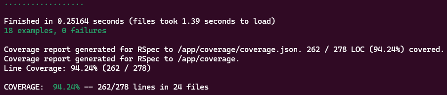

## Workshop Customer Service

Este projeto é uma API Rails para gerenciamento de clientes e veículos, focada em operações de oficina.

### Principais Funcionalidades
- Cadastro e consulta de clientes
- Cadastro e consulta de veículos

### Estrutura do Projeto
- **app/layers/application**: Lógica de aplicação, comandos e casos de uso
- **app/layers/domain**: Modelos de domínio (cliente, veículo)
- **app/layers/infra**: Repositórios, jobs, query objects, models
- **app/layers/serializers**: Serialização de entidades de domínio
- **app/layers/web/controllers**: Controllers da API
- **lib/exceptions**: Exceções customizadas
- **db**: Migrações, seeds e schema
- **infra/k8s**: Configurações Kubernetes
- **infra/terraform**: Infraestrutura como código
- **spec**: Testes automatizados

### Principais Tecnologias
- Ruby on Rails 7.2
- PostgreSQL
- Docker e Docker Compose
- RSpec, FactoryBot, SimpleCov, Faker
- Datadog, Lograge

### Como rodar o projeto
1. Instale Docker e Docker Compose
2. Execute `make setup` para buildar e preparar o ambiente
3. Suba o serviço com `make up`
4. Acesse a API em http://localhost:3000

### Comandos úteis (Makefile)
- `make setup`: Builda e prepara o banco
- `make up`: Sobe os containers
- `make down`: Para os containers
- `make test`: Executa os testes
- `make console`: Abre console Rails
- `make db-create`: Cria e migra o banco
- `make db-recreate`: Refaz o banco e aplica seeds

### Testes
Os testes estão em `spec/`. Use `make test` para rodar.

### Cobertura de Testes

### Documentação
Swagger disponível via rswag (ver gems e inicializadores).

### Infraestrutura
Configurações para Kubernetes e Terraform em `infra/`.
